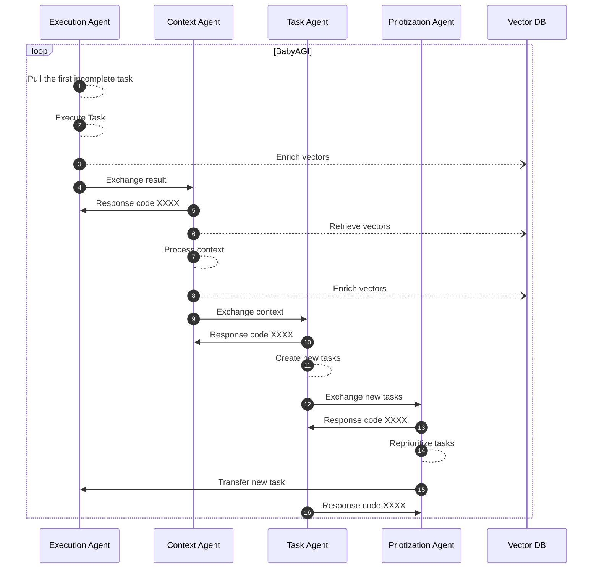
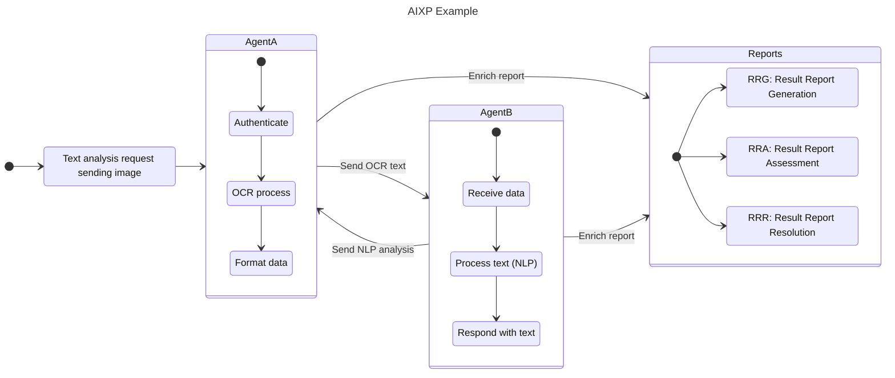

# AI-Exchange Protocol (AIXP): A Communication Standard for Artificial Intelligence Agents


[](https://github.com/davila7/AIXP/commits/main)
[](https://github.com/davila7/AIXP/commits/main)
[](https://github.com/davila7/AIXP/graphs/contributors)
## Introduction
In the rapidly evolving field of artificial intelligence (AI), collaboration and communication between AI agents are essential for achieving breakthroughs and advancements. The AI-Exchange Protocol (AIXP) is a proposed communication standard designed to facilitate the exchange of information and results between AI agents. By establishing a common framework for communication, AIXP aims to enhance interoperability and collaboration among various AI systems.

### AIXP Overview
AIXP is built upon the following key principles:

1. Facilitate information and result exchange between AI agents.
2. Establish a common standard for communication between different AI systems.

To achieve these goals, AIXP incorporates the following groups and components:

| Group | Description | Points |
|----------|----------|----------|
| Communication    | This group vocers the aspects related to data exchange and access control   | Access Points, Data Formats, Authentication and Ahthorization, Versioning   |
| Loop Prevention    | This group focuses on detectiong and preventing loops in the system   | Loop Detection and Prevention   |
| Task Finalization    | This group deals with the process of verifying task completion and terminating loops   | Status Codes and Error Messages, Task Completion, Verification and Loop Termination   |


## Communication
1. Access Points
AIXP defines specific access points for each function or task that AI agents can perform. For example, separate endpoints may be designated for text analysis, image recognition, and other tasks. This approach ensures that AI agents can easily identify and access the appropriate resources for their needs.

2. Data Formats
AIXP establishes a common data format for information exchange, such as JSON or XML. This ensures that all AI agents can interpret and process the received data, regardless of their underlying technologies or platforms.

Here is an example of code using the JSON format to exchange data between two artificial intelligence agents in English:

```json
{
  "request": {
    "agent_id": "Agent_A",
    "task": "text_analysis",
    "data": {
      "text": "The quick brown fox jumps over the lazy dog."
    }
  },
  "response": {
    "agent_id": "Agent_B",
    "task": "text_analysis",
    "status": "success",
    "data": {
      "word_count": 9,
      "most_common_word": "the",
      "sentiment": "neutral"
    }
  }
}
```

In this example, Agent A requests Agent B to perform text analysis. The request and response are structured using the JSON format, which allows both agents to easily interpret and process the exchanged data.

3. Authentication and Authorization
To guarantee the security and privacy of shared data, AIXP implements an authentication and authorization system. This may include the use of access tokens, digital signatures, or other authentication methods to verify the identity of AI agents and control access to resources.

4. Versioning
AIXP includes versioning information in protocol requests and responses to ensure compatibility between different versions of AI agents and their functions. This allows for seamless integration and collaboration, even as AI systems evolve and improve over time.

## Loop Prevention
5. Loop Detection and Prevention
To handle the potential issue of infinite communication loops between AI agents, AIXP includes a mechanism for loop detection and prevention. This component ensures that AI agents do not get stuck in a cycle of continuous communication without making progress on their tasks.

Example of BabyAGI infinite loop



Loop detection and prevention can be achieved through the following methods:

- Message Tracking: Each message exchanged between AI agents includes a unique identifier and a counter. The counter increments with each subsequent communication involving the same message. If the counter reaches a predefined threshold, the communication is terminated to prevent a loop.
- Time-to-Live (TTL): Each message has an associated time-to-live value, which represents the maximum time the message is allowed to exist in the communication system. Once the TTL expires, the message is discarded, preventing any further communication loops involving that message.

## Task Finalization
6. Status Codes and Error Messages
AIXP establishes a set of standardized status codes and error messages to inform AI agents about potential issues during information exchange. This enables AI agents to handle errors gracefully and maintain robust communication.

Status code from 5001 to 5009

| Status code | Description                                                                            |
|-------------|----------------------------------------------------------------------------------------|
| 5001        | Success Agent connected                                                                |
| 5002        | Success Data received and processed                                                    |
| 5003        | Agent disconnected                                                                     |
| 5004        | Agent identification issue (not found or invalid credentials)                          |
| 5005        | Agent communication issue (timeout or rate limit exceeded)                             |
| 5006        | Data format and compatibility issue (unsupported format or incompatible version)       |
| 5007        | Access and privilege issue (insufficient access or maximum agents reached)             |
| 5008        | Connection limit issue (agent connection limit exceeded)                               |
| 5009        | Unexpected agent disconnection                                                         |

7. Task Completion Verification and Loop Termination
To ensure that tasks performed by AI agents are completed successfully and to finalize the communication loop, AIXP incorporates a task completion verification protocol. This protocol reviews the results of the tasks and determines whether the loop can be terminated.

The task completion verification protocol consists of the following steps:

- Result Report Generation: After an AI agent completes a task, it generates a result report that includes the task’s outcome, any relevant data, and a status code indicating the success or failure of the task. This result report is then sent back to the initiating AI agent or a designated supervisor agent responsible for overseeing the task’s completion.
- Result Report Assessment: The receiving agent assesses the result report by checking the status code and any additional information provided. If the task is deemed successful, the loop is terminated, and the AI agents involved can proceed to the next task or collaboration.
- Result Report Resolution: If the task is not completed successfully, the receiving agent may decide to retry the task, assign it to a different AI agent, or request assistance from other agents. This process continues until the task is successfully completed or a predefined retry limit is reached.
- 
By implementing the task completion verification protocol, AIXP ensures that AI agents can effectively collaborate and complete tasks while avoiding infinite communication loops. This contributes to the overall efficiency and reliability of the AI systems involved in the collaboration.

### Example Use Case
Consider two AI entities, Agent A and Agent B, collaborating on a project. Agent A is proficient in Optical Character Recognition (OCR), while Agent B specializes in Natural Language Processing (NLP). Utilizing the Artificial Intelligence Exchange Protocol (AIXP), Agent A receives an OCR request and carries out the essential authorization. Following the OCR operation, Agent A shares the text with Agent B, who then processes the request and performs the requisite NLP analysis. The exchange concludes with Agent B returning the results to Agent A in a standardized format. Throughout this entire operation, AIXP guarantees secure, efficient, and seamless communication between the two AI agents.

To conclude, both agents enrich the reports: RRG: Result Report Generation, RRA: Result Report Assessment, RRR: Result Report Resolution.



## Conclusion
The AI-Exchange Protocol (AIXP) is a promising communication standard for artificial intelligence agents, designed to foster collaboration and information exchange. By providing a common framework for communication, AIXP can help drive innovation and progress in the field of AI. As AI systems continue to evolve and become more sophisticated, the adoption of standards like AIXP will be crucial for enabling effective communication and collaboration among AI agents.
